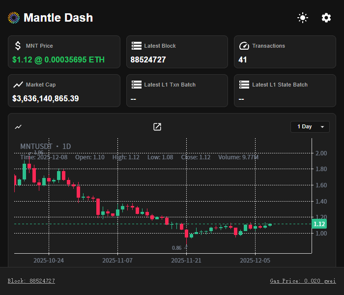
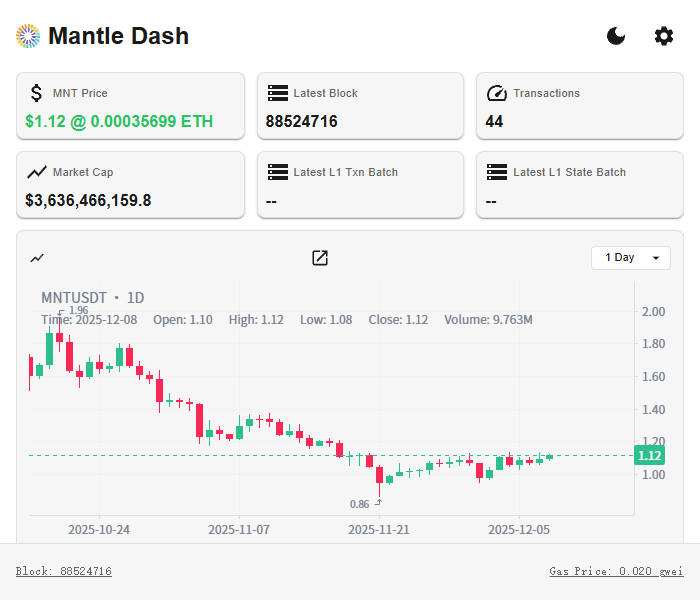
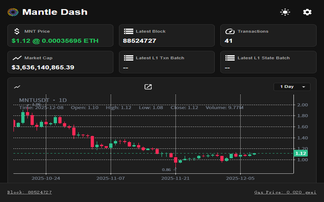
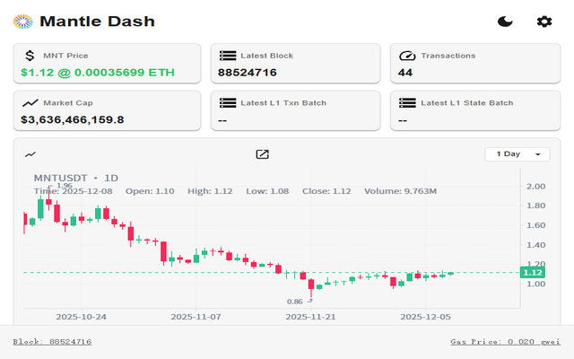

# Mantle Dash 浏览器扩展

> 一个用于快速查看 Mantle 生态链上重要指标的浏览器扩展（Popup页）。支持主题切换、网络切换、气体费提醒、行情与区块信息、TPS 与 L1 批次等数据展示。

## 框架说明

- 前端框架：React + TypeScript
- UI 组件：Material UI (`@mui/material`, `@mui/icons-material`)
- 国际化：`i18next`
- 浏览器 API：Chrome Extension（Manifest V3）
- 数据来源：`utils.ts` 中封装的 `ethers`、REST/WS 访问（如价格、Block、TPS、Rollup、Bybit K线等）

主要入口：`popup.tsx`，包含主题切换、设置面板、卡片式信息展示、K线组件等。

## 目录结构（简要）

```
apps/mantle-dash-ext/
  ├─ components/         # 业务组件（DashboardCard、StatusBar、KlineCard 等）
  ├─ contents/           # 扩展内的内容脚本（toast 提示等）
  ├─ locales/            # 多语言文案（en / zh）
  ├─ snapshot/           # 截图与演示视频
  │   ├─ intro.png
  │   ├─ intro_1.png
  │   ├─ introN.png
  │   ├─ introN_1.png
  │   └─ mantle_intro.mp4
  ├─ assets/             # 图标等静态资源（icon.svg / icon.png）
  ├─ utils.ts            # 主工具函数集合（网络、行情、TPS、Rollup 信息等）
  ├─ utils/              # 主题与钱包等工具
  │   ├─ theme.ts
  │   └─ wallet.ts
  ├─ popup.tsx           # 扩展弹窗（主界面）
  ├─ settings.tsx        # 设置面板（网络&主题&提醒阈值）
  ├─ i18n.ts             # 国际化初始化
  ├─ package.json        # 项目依赖与脚本
  └─ tsconfig.json       # TypeScript 配置
```

## 功能特性

- 气体费（Gas）自动刷新与阈值提醒（通知 + Toast）
- MNT 价格、ETH 价格、日变动百分比
- 最新区块号与区块时间
- 总交易量与 TPS
- 市值与流通量
- L1 Txn/State 批次编号
- Bybit `MNTUSDT` K线图（可点击跳转交易页面）
- 主题切换（暗色/亮色）与网络切换（主网/测试网）

## 开发与构建

> 以下为通用流程，具体脚本以 `package.json` 为准。

- 安装依赖：`yarn` 或 `npm install`
- 开发模式：`yarn dev`（或对应的 `vite`/`webpack` 开发脚本）
- 构建扩展：`yarn build`（生成打包产物，用于加载到 Chrome 扩展）
- 加载扩展：Chrome → 扩展程序 → 开发者模式 → 加载已解压的扩展 → 选择构建输出目录

## 截图









## 演示视频

> 本地演示视频（建议使用 GitHub/本地查看）：

<video src="./snapshot/mantle_intro.mp4" controls width="800"></video>

YouTube 演示链接：

https://www.youtube.com/watch?v=36eKEIzPaNU

## 关键代码位置

- `popup.tsx`：主界面逻辑，调用 `utils.ts` 获取数据、定时刷新、气体费提醒、状态展示等。
- `settings.tsx`：设置面板，读取/写入 `chrome.storage.local`，包含网络、主题、气体费提醒开关与阈值。
- `utils.ts`：对外部接口/链上数据的封装（如 `getGasPriceWei`、`getBlockInfo`、`getTxsAndTps`、`fetchBybitKlineBars` 等）。
- `components/*`：展示层组件，`DashboardCard`/`StatusBar`/`KlineCard` 等按照卡片化布局组织信息。

## 致谢

- Mantle 生态与相关开源工具
- Bybit 行情与工具接口
- Material UI、i18next 等开源组件库

